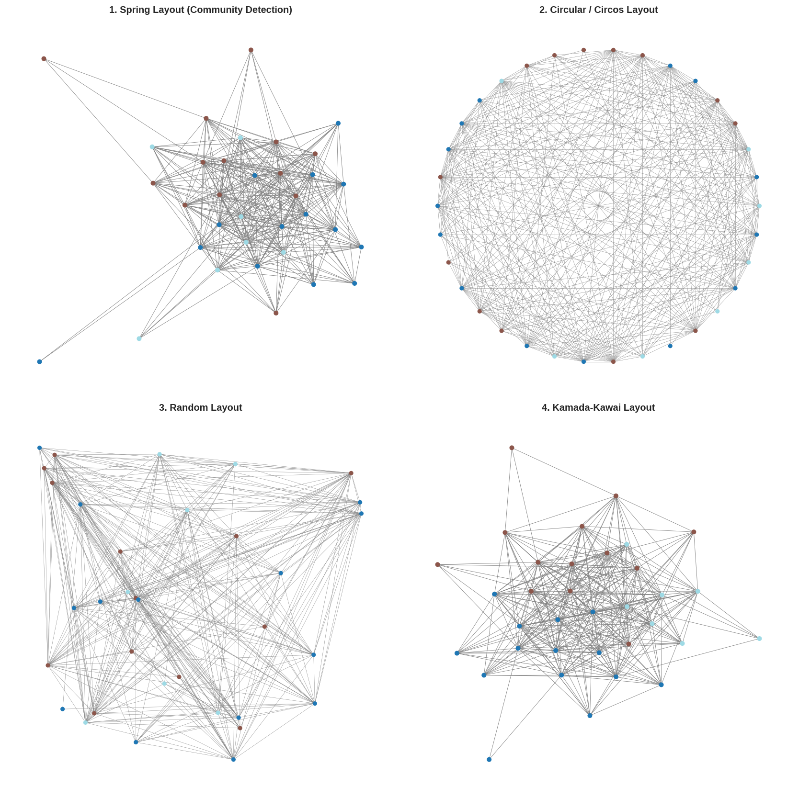
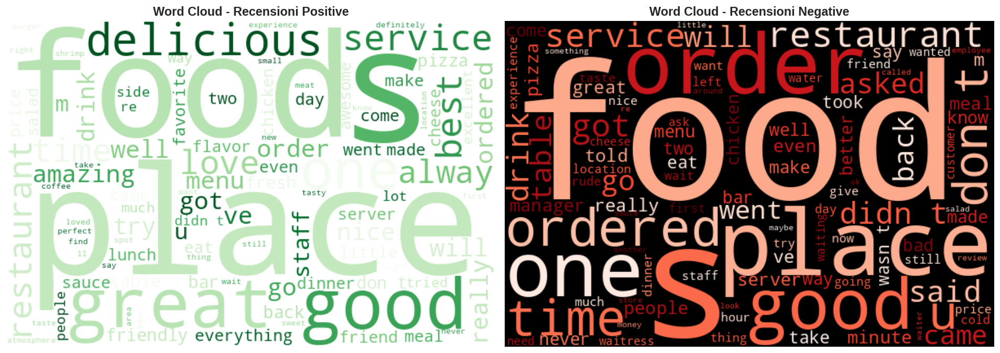
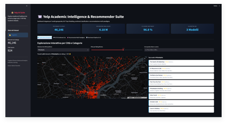
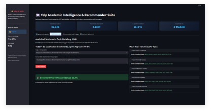
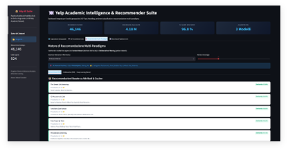
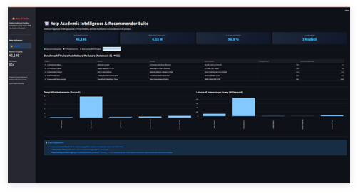

# Yelp Big Data Intelligence & Hybrid Recommender System 🍕📊

[](https://www.python.org/)
[](https://jupyter.org/)
[](https://pola.rs/)
[](https://scikit-learn.org/)
[](https://www.tensorflow.org/)

Un'architettura completa di Data Science e Machine Learning applicata all'enorme **Yelp Academic Dataset** (oltre 150.000 attività commerciali e 4 milioni di recensioni). 
Il progetto dimostra come gestire file di svariati GigaByte senza problemi di memoria (OOM) sfruttando **Polars** per l'ingestion e l'aggregazione, e librerie classiche (Scikit-Learn, TensorFlow, NetworkX) per algoritmi complessi di NLP, Network Analysis e Sistemi di Raccomandazione.

---

## 🌟 Architettura e Moduli della Pipeline

L'analisi è suddivisa in 5 Jupyter Notebooks riproducibili e sequenziali:

```text
├── Yelp_01_Ingestion_Preprocessing.ipynb       # Filtraggio, pulizia e conversione in Parquet con Polars
├── Yelp_02_EDA_Geospatial_Networks.ipynb       # Analisi spaziali GIS (Folium) e grafi di interazione (NetworkX)
├── Yelp_03_NLP_Sentiment_TopicModeling.ipynb   # Sentiment Analysis e Topic Modeling (LDA) sulle recensioni
├── Yelp_04_Recommender_Systems.ipynb           # Collaborative Filtering (SVD) e Deep Learning
└── Yelp_05_Pipeline_Integration_Benchmark.ipynb # Benchmark delle metriche e Report di Business Intelligence
```

### ✨ Novità: Motore Polars Integrato
L'intera pipeline è stata recentemente convertita da Pandas a **Polars**, permettendo:
- Caricamenti quasi istantanei da file Parquet.
- Utilizzo ottimizzato della RAM per le operazioni di `group_by` e `filter` su milioni di righe.
- Zero crash della memoria (Out-Of-Memory) durante la manipolazione del massiccio database delle recensioni (5GB+).

---

## 📊 Analisi ed Esplorazione nei Notebook

Nel corso dei notebook vengono prodotte diverse visualizzazioni avanzate. Ecco alcuni esempi chiave (salva i tuoi grafici in `docs/assets/` con questi nomi per visualizzarli qui):

> 🕸️ **Grafo di Rete Bipartita (NetworkX - Louvain Modularity)**
> 

> ☁️ **WordCloud dei Topic e Sentiment Analysis**
> 

---

## 💻 Streamlit Web Dashboard

Oltre all'analisi nei notebook, il progetto include un'applicazione **Streamlit** interattiva (Yelp AI Suite) per esplorare visualmente i risultati: mappe GIS dei ristoranti, report del Sentiment delle recensioni, grafi di rete e suggerimenti del Recommender System.

### Avviare l'App
```bash
uv run streamlit run app.py
```

### Anteprima della Dashboard
Ecco come si presenta la dashboard in azione (salva i 4 screenshot della UI in `docs/assets/`):

> 📍 **Analisi Geospaziale e Mappe Interattive**
> 

> 💬 **Sentiment Analysis & Topic Modeling**
> 

> 🤖 **Motore di Raccomandazione Multi-Paradigma**
> 

> 📈 **Benchmark Architettura e Performance**
> 

---

## 📥 Come Ottenere i Dati (Dataset)

Il set di dati ufficiale non è incluso nella repository per via delle sue dimensioni.
1. Scarica il dataset gratuito dal sito ufficiale: **[Yelp Open Dataset](https://www.yelp.com/dataset)**.
2. Estrai i file `.json` (in particolare `yelp_academic_dataset_business.json` e `yelp_academic_dataset_review.json`).
3. Posizionali in una cartella accessibile dai notebook o su Google Drive (se usi Colab).

---

## 🚀 Setup e Installazione (Locale o Colab)

### Opzione A: Esecuzione Locale (Consigliata per macchine performanti)
1. Clona il repository:
   ```bash
   git clone https://github.com/valeriofiorentini/yelp-bigdata-mining-recommender.git
   cd yelp-bigdata-mining-recommender
   ```
2. Installa le dipendenze in modo ultra-rapido utilizzando il package manager `uv`:
   ```bash
   uv sync
   ```
   *(Le dipendenze principali includono: `polars`, `pandas`, `scikit-learn`, `tensorflow`, `networkx`, `folium`, `loguru`)*.
3. Esegui i notebook nell'ordine numerato da `01` a `05`.

### Opzione B: Esecuzione su Google Colab (Google Drive)
Se il tuo PC non ha abbastanza risorse, l'intero progetto è compatibile con **Google Colab**.
1. Carica i file `.json` del dataset all'interno del tuo Google Drive in una cartella specifica (es. `Mio Drive/Yelp_Dataset/`).
2. Apri i notebook con Google Colab.
3. Esegui la cella di setup iniziale che installerà le librerie necessarie (tramite `%pip install`) e monterà automaticamente il tuo Google Drive per leggere i dati e salvare gli output intermedi in formato compresso `.parquet`.

---

## 👤 Autore

**Valerio Fiorentini**
- Portfolio: [cv-fiorentini-valerio.vercel.app](https://cv-fiorentini-valerio.vercel.app)
- GitHub: [@valeriofiorentini](https://github.com/valeriofiorentini)
- Email: [valeriofiorentini2002@gmail.com](mailto:valeriofiorentini2002@gmail.com)
