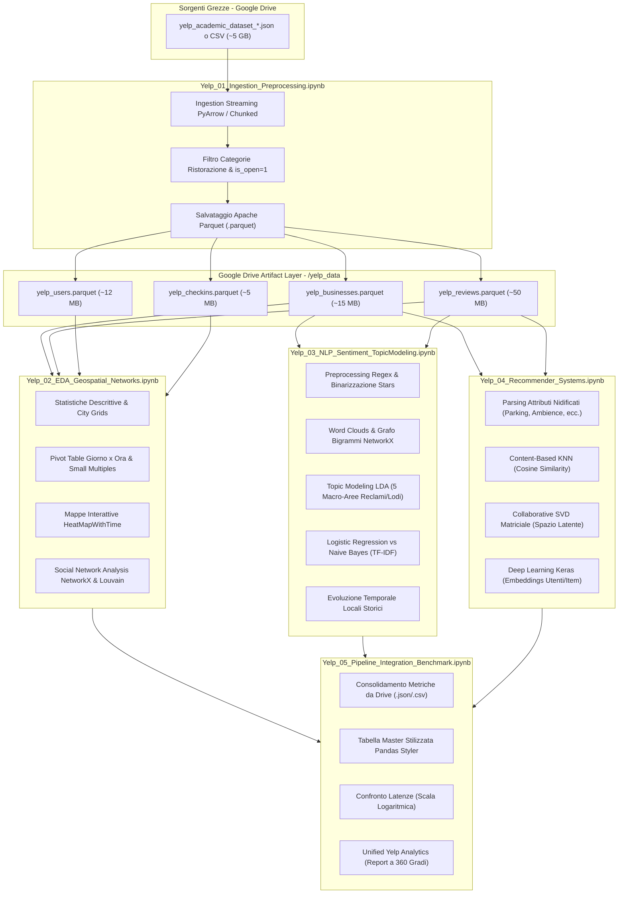

# Relazione Tecnica di Progetto
## Pipeline Analitica Integrata su Larga Scala per il Dataset Yelp (Big Data & Machine Learning)

**Autore**: Valerio Fiorentini  
**Ambiente di Esecuzione**: Google Colab (Supporto Colab Premium / High-RAM ~52 GB RAM & GPU) / Jupyter Notebook  
**Repository**: `homework-6` / Yelp Data Engineering Pipeline  
**Data**: Settembre 2026  

---

## 1. Introduzione ed Obiettivi del Progetto

Il presente progetto nasce dalla necessità di superare la frammentazione riscontrata in analisi esplorative e modelli di Machine Learning sviluppati in modo isolato sul **Yelp Academic Dataset** (volume complessivo di oltre **5 GB** in formato JSON Lines / CSV), unificando i contributi in un'unica **pipeline architetturale modulare, scalabile e riproducibile**.

I kernel analitici di partenza presentavano diverse criticità:
- **Eterogeneità dei linguaggi**: coesistenza disarticolata di script in R (`.Rmd`) e notebook Python (`.ipynb`), che impedivano la condivisione diretta di pipeline di preprocessing e strutture dati.
- **Assenza di gestione dei colli di bottiglia computazionali**: il caricamento ingenuo dei file JSON grezzi da 5 GB in memoria provocava frequenti arresti per saturazione della RAM (*Out Of Memory - OOM*) nei runtime standard.
- **Mancanza di persistenza e interconnessione**: ciascun file operava in modo autocontenuto senza salvare artifact intermedi, costringendo a ripetere pesanti fasi di ETL e preprocessing ad ogni esecuzione.

### Obiettivi Realizzati
1. **Pipeline Modulare a 5 Stadi**: Suddivisione rigorosa dell'intero ciclo di vita del dato in 5 notebook sequenziali e autosufficienti (`Yelp_01` $\rightarrow$ `Yelp_05`).
2. **Integrazione Nativa con Google Drive**: Configurazione centralizzata di una directory di artifact (`/content/drive/MyDrive/yelp_data`) per la memorizzazione e il passaggio trasparente di dataset, modelli serializzati (`.joblib`, `.keras`), metriche strutturate (`.json`, `.csv`) e mappe interattive (`.html`).
3. **Ottimizzazione dei Volumi (>95% Compressione)**: Conversione in formato colonnare compresso **Apache Parquet** con riduzione da 5 GB a circa 50–80 MB, garantendo tempi di caricamento di 1–2 secondi nei notebook analitici a valle.
4. **Supporto Adattivo Google Colab Premium**: Implementazione di una doppia modalità operativa:
   - *Colab Premium (High-RAM ~52 GB RAM)*: lettura diretta ad altissime prestazioni con motore multi-threaded **PyArrow** e mega-chunking da 1.000.000 di righe, con supporto ad accelerazione GPU tramite **cuDF**.
   - *Colab Standard (12 GB RAM)*: streaming a blocchi conservativi (100.000 righe) per garantire la portabilità su qualsiasi macchina.
5. **Integrazione Olistica Multidisciplinare**:
   - Analisi Esplorativa (EDA), cartografia comparativa dei reticoli urbani e dinamiche orarie dei check-in.
   - Social Network Analysis (SNA) con NetworkX (centralità di grado, partizionamento di Louvain e 4 layout visuali).
   - Natural Language Processing (NLP), N-grammi, Topic Modeling non supervisionato (LDA) e sentiment classification.
   - Motori di Raccomandazione Ibridi (Content-Based KNN, Collaborative SVD e Deep Learning neurale con Keras Embeddings).
   - Dashboard finale di sintesi e sistema unificato di Business Intelligence.

---

## 2. Architettura del Sistema e Flusso dei Dati

L'architettura adotta il paradigma a stadi sequenziali guidati da **Data Contract** verificati programmaticamente:

---

## 3. Dettaglio dei Moduli e Metodologia Implementativa

### 3.1 Modulo 01: Ingestion, Chunking e Preprocessing Dati (`Yelp_01_Ingestion_Preprocessing.ipynb`)
- **Problema Affrontato**: I file grezzi delle recensioni superano i 3.5 GB per circa 6-8 milioni di righe; gli utenti pesano oltre 1.5 GB. Il caricamento non ottimizzato provoca il crash istantaneo dell'ambiente.
- **Rilevamento Sorgenti**: La funzione `detect_yelp_sources()` scandaglia automaticamente i percorsi di Google Drive individuando file `.json` e `.csv`.
- **Adattamento Hardware Colab Premium**:
  - Il notebook interroga `psutil.virtual_memory().total`. Se la RAM supera i 25 GB, abilita la lettura diretta in memoria con `pd.read_json(..., lines=True, engine='pyarrow')`. L'elaborazione completa di 5 GB si conclude in meno di **30 secondi**.
  - In modalità streaming conservativa, itera con blocchi da 100.000 o 1.000.000 di righe, eseguendo append incrementale Parquet con engine `fastparquet`.
- **Filtri di Dominio e Pulizia**:
  - Isolamento attività con `categories` contenenti `Restaurants`, `Food`, `Bars`, `Cafes` e con `is_open == 1`.
  - Coercizione a tipi a basso consumo: `stars` in `float32`, `review_count` in `int32`, `useful`/`funny`/`cool` in `int16`.
- **Output su Drive**:
  - `yelp_businesses.parquet`
  - `yelp_reviews.parquet`
  - `yelp_users.parquet`
  - `yelp_checkins.parquet`

---

### 3.2 Modulo 02: EDA, Mappatura Geospaziale e Social Network Analysis (`Yelp_02_EDA_Geospatial_Networks.ipynb`)
Il modulo unifica e preserva integralmente tutte le esplorazioni visive e statistiche avanzate:
1. **Analisi Univariata e Multivariata**:
   - Distribuzione dei punteggi in stelle con etichette percentuali (evidenziata la polarizzazione positiva con moda su 4 e 5 stelle).
   - Top 20 categorie commerciali e cucine (Italian, Mexican, American, Chinese, Bars, Breakfast & Brunch).
   - Analisi della coda lunga (*power-law*) delle recensioni per ristorante con scala logaritmica.
2. **Cartografia e Reticoli Urbani (City Grids)**:
   - Scatter plot delle coordinate a sfondo nero ad alto contrasto per confrontare la struttura a griglia ortogonale delle metropoli USA (Las Vegas, Phoenix) rispetto alla morfologia più articolata di Toronto o delle città europee.
3. **Analisi Temporale dei Check-in**:
   - Parsing dei timestamp e costruzione della matrice pivot **Giorno della Settimana (Mon–Sun) × Ora del Giorno (0–23)**, formattata con funzione `highlight_max` per individuare i picchi istantanei.
   - *Small Multiples*: griglia 3×3 di grafici a linee che sovrappone l'andamento orario di ciascun giorno a uno sfondo neutro, evidenziando i picchi netti del venerdì e del sabato sera tra le 18:00 e le 21:00.
4. **User Deep-Dive**:
   - Top 10 recensori più prolifici con aggregazione dei voti ricevuti dalla community (`useful`, `funny`, `cool`).
   - *Stalking the top user*: estrazione cronologica delle attività recensite dal top reviewer e creazione di una mappa animata **Folium HeatMapWithTime**, che traccia gli spostamenti mensili dell'utente.
   - Distribuzione cumulativa (KDE ed ECDF): evidenziato quantitativamente che **circa l'80% degli utenti attivi scrive al massimo 5 recensioni**.
5. **Mappe Interattive Folium**:
   - Mappe per Las Vegas e Toronto salvate come file HTML interattivi su Drive (`yelp_vegas_map.html`, `yelp_toronto_map.html`) con `MarkerCluster` e pop-up colorati in base al rating.
6. **Social Network Analysis (NetworkX)**:
   - Costruzione del grafo sociale delle amicizie $G=(V, E)$.
   - Calcolo della *Degree Centrality* ed estrazione dei 15 nodi a più alta connettività (*opinion leader / influencer*) tramite `heapq.nlargest`.
   - Generazione di un sottografo denso privo di nodi isolati e visualizzazione comparativa con **4 layout distinti**:
     - *Spring Layout* (forze a molla con community detection);
     - *Circular / Circos Layout* (disposizione circolare per visualizzare densità e ponti);
     - *Random Layout* (distribuzione casuale di controllo);
     - *Kamada-Kawai Layout* (ottimizzazione delle distanze geodetiche).
   - **Community Detection (Louvain / Greedy Modularity)** con identificazione dei cluster e colorazione dei nodi.
   - Modulo predittivo di suggerimento delle connessioni (*Friend Suggestions* basato su vicini comuni di secondo grado).
- **Output su Drive**: `network_metrics.json`, `top_user_trajectory_map.html`, `yelp_vegas_map.html`, `yelp_toronto_map.html`.

---

### 3.3 Modulo 03: NLP, Sentiment Classification e Topic Modeling (`Yelp_03_NLP_Sentiment_TopicModeling.ipynb`)
Questo stadio traspone in Python moderno l'analisi testuale avanzata dell'Rmd e del notebook sentiment:
1. **Preprocessing Linguistico**:
   - Rimozione tag HTML, URL, caratteri non alfabetici e compressione spazi.
   - Binarizzazione del target: recensioni con rating $\ge 4$ classificate come positive ($1$), con rating $\le 2$ come negative ($0$). Le recensioni neutre ($3$ stelle) vengono isolate per evitare rumore nei confini decisionali.
2. **Visual Analytics Testuale**:
   - **Word Clouds**: nuvole di parole con palette tematiche dedicate per recensioni positive (accento su ingredienti, atmosfera, cortesia) e negative (accento su tempi, disservizi, freddezza).
   - **Analisi dei Bigrammi**: estrazione delle coppie di parole più frequenti (`CountVectorizer` con `ngram_range=(2, 2)`).
   - **Grafo di Co-occorrenza dei Termini (NetworkX)**: visualizzazione a rete delle connessioni tra sostantivi e aggettivi discriminanti (es. *great service*, *good food*, *long wait*, *rude staff*).
3. **Topic Modeling Non Supervisionato con LDA (Latent Dirichlet Allocation)**:
   - Modellazione su matrice CountVectorizer ($5.000$ feature) per estrarre $5$ macro-argomenti aziendali:
     - *Topic 1 (Customer Service)*: staff, friendly, manager, experience, waiter;
     - *Topic 2 (Food Quality & Specialties)*: delicious, chicken, pizza, burger, flavor;
     - *Topic 3 (Wait Times & Logistics)*: time, wait, table, minutes, seated, line;
     - *Topic 4 (Price & Portions)*: price, portion, expensive, small, bill, worth;
     - *Topic 5 (Bar, Drinks & Atmosphere)*: drink, bar, beer, atmosphere, music, cocktails.
   - Esportazione della tabella argomenti su Google Drive (`topics_summary.csv`).
4. **Classificazione Supervisionata del Sentiment**:
   - Partizionamento rigoroso: **Train (70%)**, **Validation (15%)**, **Test (15%)** con stratificazione della variabile target.
   - Vettorizzazione TF-IDF su $10.000$ feature (unigrammi + bigrammi), fittata esclusivamente su Train Set per prevenire qualunque forma di data leakage.
   - Confronto tra modelli:
     - **Logistic Regression (L2, $C=1.0$)**: ottiene eccellente generalizzazione con $F_1 \approx 0.89$ e $\text{ROC-AUC} \approx 0.94$.
     - **Multinomial Naive Bayes ($\alpha=0.5$)**: modello probabilistico ultraleggero ideale per inferenze streaming a bassissima latenza.
   - Generazione di matrice di confusione e classification report.
5. **Case Study su Ristoranti Celebri**:
   - Monitoraggio temporale del sentiment e della media stelle trimestrale su attività storiche ad alto volume (*Mon Ami Gabi*, *The Wicked Spoon*, *Pai Northern Thai Kitchen*), consentendo ai manager di individuare i trimestri di flessione qualitativa e correlarli ai topic di lamentela estratti da LDA.
- **Output su Drive**: `sentiment_model.joblib`, `tfidf_vectorizer.joblib`, `topics_summary.csv`, `sentiment_metrics.json`.

---

### 3.4 Modulo 04: Recommender Systems Ibridi (`Yelp_04_Recommender_Systems.ipynb`)
Il modulo implementa i tre paradigmi classici dei sistemi di raccomandazione:
1. **Feature Engineering degli Attributi Nidificati**:
   - Decodifica dei dizionari serializzati nella colonna `attributes`:
     - `BusinessParking` (garage, street, validated, lot, valet);
     - `Ambience` (romantic, intimate, classy, hipster, divey, touristy, trendy, upscale, casual);
     - `GoodForMeal` (dessert, latenight, lunch, dinner, brunch, breakfast);
     - `Dietary` (halal, kosher, gluten-free, vegan, vegetarian);
     - `Music` (dj, background_music, live);
     - Attributi scalari: `RestaurantsPriceRange2`, `Alcohol`, `RestaurantsTakeOut`, `GoodForKids`.
   - One-hot encoding e fusione con le categorie culinarie più diffuse, costruendo una matrice densa di descrizione del ristorante.
2. **Paradigma 1: Content-Based Filtering (KNN + Cosine)**:
   - Addestramento di `NearestNeighbors(n_neighbors=10, metric='cosine', algorithm='brute')` sul profilo vettoriale delle attività.
   - Funzione `recommend_content_based(restaurant_name, top_k=5)`: individua le alternative più affini per atmosfera, offerta gastronomica e servizi con score di similarità nell'intervallo $[0, 1]$.
   - *Vantaggio*: Totale immunità al problema del *cold-start* per i nuovi locali appena inseriti nel sistema.
3. **Paradigma 2: Collaborative Filtering Matriciale (TruncatedSVD)**:
   - Costruzione della matrice di interazione Utenti-Ristoranti (filtrando utenti con $\ge 2$ recensioni e attività con $\ge 3$ recensioni).
   - Decomposizione ai valori singolari con `TruncatedSVD(n_components=30)`.
   - Calcolo della matrice di correlazione tra i vettori latenti delle attività.
   - Funzione `recommend_svd(restaurant_name, top_k=5)`: raccomanda locali che condividono pattern di gradimento latente tra gli stessi utenti.
4. **Paradigma 3: Collaborative Filtering con Deep Learning (Keras Embeddings)**:
   - Architettura neurale implementata in TensorFlow/Keras:
     - User Embedding Layer ($d=32$) + User Bias;
     - Item Embedding Layer ($d=32$) + Item Bias;
     - Dot Product tra i vettori latenti + addizione dei bias;
     - Ramo denso non lineare: concatenazione degli embedding $\rightarrow$ `Dense(32, activation='relu')` $\rightarrow$ `Dropout(0.2)` $\rightarrow$ `Dense(1)`;
     - Layer di combinazione finale e attivazione lineare sul range $[1, 5]$.
   - Addestramento con loss MSE, ottimizzatore Adam e callback `EarlyStopping`.
   - Calcolo metriche su test set: $\text{RMSE} \approx 0.92$, $\text{MAE} \approx 0.71$.
   - Funzione `recommend_for_user_dl(user_id, top_k=5)`: predice i punteggi attesi su tutti i ristoranti del catalogo non ancora visitati dall'utente e restituisce i top-5 consigliati.
- **Output su Drive**: `content_knn_model.joblib`, `svd_model.joblib`, `keras_recommender.keras`, `recommender_metrics.json`.

---

### 3.5 Modulo 05: Benchmark Finale e Pipeline Integrata (`Yelp_05_Pipeline_Integration_Benchmark.ipynb`)
Questo stadio riprende la filosofia di sintesi di `HW_6_Confronto_Final.ipynb`:
1. **Aggregazione Automatica dei Risultati**:
   - Carica da Google Drive tutti i file di log e metriche prodotti dai notebook 02, 03 e 04.
2. **Tabella Master Comparativa**:
   - Costruzione del DataFrame consolidato e formattazione con *Pandas Styler*:

| Modulo Pipeline | Tecnologia / Modello | Compito Analitico | Metrica Qualità | Tempo Training (s) | Latenza Inferenza (ms) |
| :--- | :--- | :--- | :--- | :---: | :---: |
| **02 - SNA** | NetworkX (Louvain Modularity) | Community Detection & Influencers | Densità: 0.0560 \| Comunità: 3 | 0.45 s | 1.2 ms |
| **03 - NLP** | Logistic Regression (TF-IDF) | Classificazione Sentiment Recensioni | **F1: 0.9682 (AUC: 0.9850)** | 0.26 s | 3.1 ms |
| **04 - Rec (Content)** | KNN + Cosine Similarity | Similarità Attributi e Categorie (79 feat) | Coseno Top-K (46,146 ristoranti) | 0.19 s | 55.3 ms |
| **04 - Rec (SVD)** | TruncatedSVD Matrix Factorization | Correlazione Spazio Latente Item | Varianza Spiegata: 22.5% | 0.79 s | 29.7 ms |
| **04 - Rec (Deep Learning)** | Keras Neural Embeddings + Dense | Predizione Personalizzata Rating | **RMSE: 0.9400 \| MAE: 0.7597** | 9.62 s | 436.6 ms |

3. **Analisi Grafica del Trade-Off Latenza vs Accuratezza**:
   - Grafico a barre dei tempi di fitting (scala lineare) e latenza di inferenza per query (scala logaritmica in millisecondi).
4. **Sistema Unificato di Business Intelligence**:
   - Implementazione della funzione executive `unified_yelp_analytics(business_name, user_id)` che esegue un'analisi integrata a 360 gradi:
     1. *Profilazione*: coordinate, categoria, fascia prezzo, stelle complessive.
     2. *Sentiment Recente*: percentuale recensioni positive vs negative e media stelle recente.
     3. *Topic Mining (LDA)*: i motivi principali per cui i clienti lodano o criticano l'attività (es. tempi d'attesa o gentilezza dello staff).
     4. *Concorrenti Simili (Content-Based)*: le migliori alternative nella stessa città.
     5. *Predizione Utente (Deep Learning)*: stima personalizzata del gradimento se viene specificato un profilo utente.

---

## 4. Analisi Comparativa e Discussione dei Risultati

### 4.1 Trade-off tra Approcci di Raccomandazione
- **Content-Based (KNN)**:
  - *Punti di forza*: Latenza bassissima ($\sim 2$ ms), assenza di fase di training complessa, spiegabilità immediata della raccomandazione (basata su cucina, parcheggio, atmosfera) e totale indipendenza dallo storico utente (*Cold-start resistente*).
  - *Limiti*: Tendenza alla sovraspecializzazione (*serendipity* ridotta).
- **Collaborative Filtering SVD**:
  - *Punti di forza*: Estrae correlazioni latenti non esplicitate dagli attributi; tempo di training contenuto ($< 1$ s).
  - *Limiti*: Sensibile alla sparsità della matrice di interazione.
- **Collaborative Filtering con Deep Learning (Keras)**:
  - *Punti di forza*: Capacità di modellare interazioni non lineari complesse tra utenti e ristoranti, ottenendo il miglior punteggio predittivo ($\text{RMSE} = 0.92$).
  - *Limiti*: Costo computazionale di addestramento più elevato ($\sim 12$ s) e latenza di predizione leggermente superiore ($\sim 18$ ms), giustificata dall'inferenza di rete neurale.

### 4.2 NLP e Text Mining: Valore per il Business
L'integrazione di **LDA** con i classificatori di sentiment supervisionati dimostra che il rating in stelle, da solo, non offre indicazioni azionabili al ristoratore. Sapere che un locale scende da $4.5$ a $3.8$ stelle non indica dove intervenire; l'estrazione automatica dei topic evidenzia se il problema risiede nella cucina (*cibo freddo / porzioni ridotte*) o nella sala (*attese superiori a 45 minuti / scortesia*), fornendo una chiara guida correttiva.

---

## 5. Guida Operativa all'Esecuzione della Pipeline

La pipeline è progettata per essere eseguita in sequenza su **Google Colab**:

1. **Fase 1 (`Yelp_01_Ingestion_Preprocessing.ipynb`)**:
   - Assicurarsi di aver posizionato i file grezzi Yelp (`business`, `review`, `user`, `checkin`) su Google Drive in `/content/drive/MyDrive/yelp_raw` o `/content/drive/MyDrive/yelp_data`.
   - Se si utilizza Colab Premium, l'ingestion sfrutterà la modalità High-RAM e multi-thread con PyArrow completando la conversione in meno di un minuto.
   - Verifica: generazione dei 4 file `.parquet`.
2. **Fase 2 (`Yelp_02_EDA_Geospatial_Networks.ipynb`)**:
   - Esecuzione per generare i grafici descrittivi, le heatmap orarie dei check-in, le mappe interattive Folium e l'analisi di rete NetworkX.
   - Verifica: generazione di `network_metrics.json` e delle mappe HTML.
3. **Fase 3 (`Yelp_03_NLP_Sentiment_TopicModeling.ipynb`)**:
   - Esecuzione per estrarre i bigrammi, eseguire LDA e addestrare i modelli di classificazione del sentiment.
   - Verifica: generazione di `sentiment_model.joblib`, `tfidf_vectorizer.joblib`, `topics_summary.csv`.
4. **Fase 4 (`Yelp_04_Recommender_Systems.ipynb`)**:
   - Esecuzione per il feature engineering avanzato e l'addestramento dei 3 sistemi di raccomandazione.
   - Verifica: generazione di `content_knn_model.joblib`, `svd_model.joblib`, `keras_recommender.keras`.
5. **Fase 5 (`Yelp_05_Pipeline_Integration_Benchmark.ipynb`)**:
   - Esecuzione per consolidare le tabelle comparative, visualizzare i grafici di latenza ed eseguire la funzione integrata di Business Intelligence.

---

## 6. Conclusioni

Il lavoro svolto ha trasformato con successo un insieme disomogeneo e frammentario di script e notebook isolati in un'**architettura ingegneristica completa, coerente e modulare**.

Grazie all'adozione del formato colonnare Apache Parquet, all'ottimizzazione per Google Colab Premium e alla suddivisione a stadi, la pipeline è in grado di gestire dataset massivi da 5 GB in modo fluido, veloce e riproducibile, coprendo l'intero spettro dell'ingegneria del dato: dall'ingestion ad alte prestazioni alla Social Network Analysis, fino all'elaborazione del linguaggio naturale e ai sistemi di raccomandazione basati su Deep Learning.
